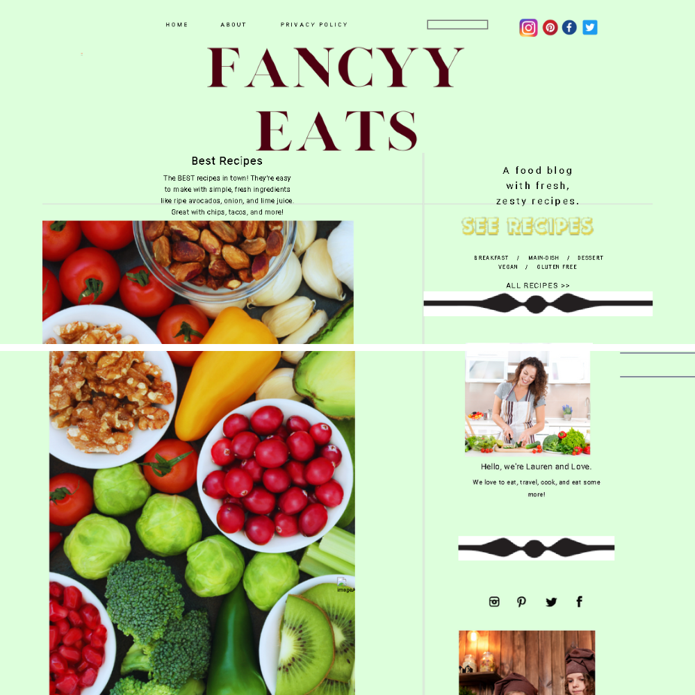
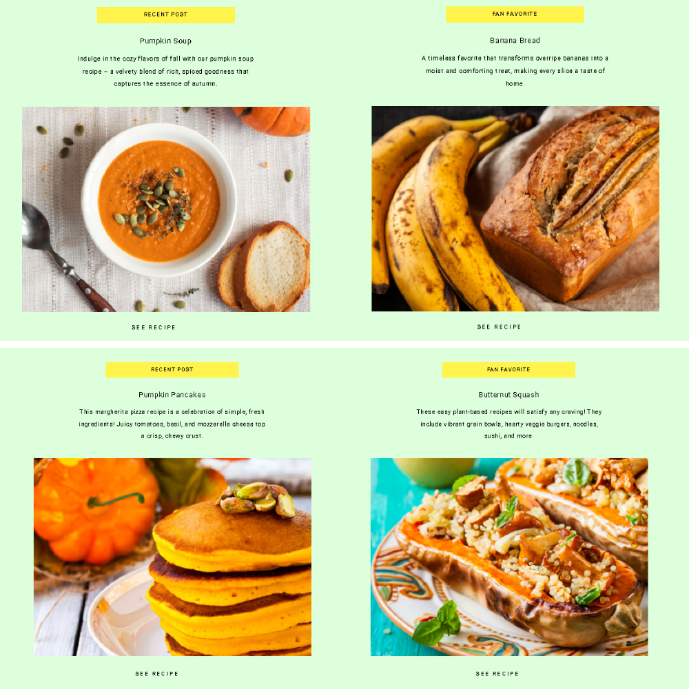
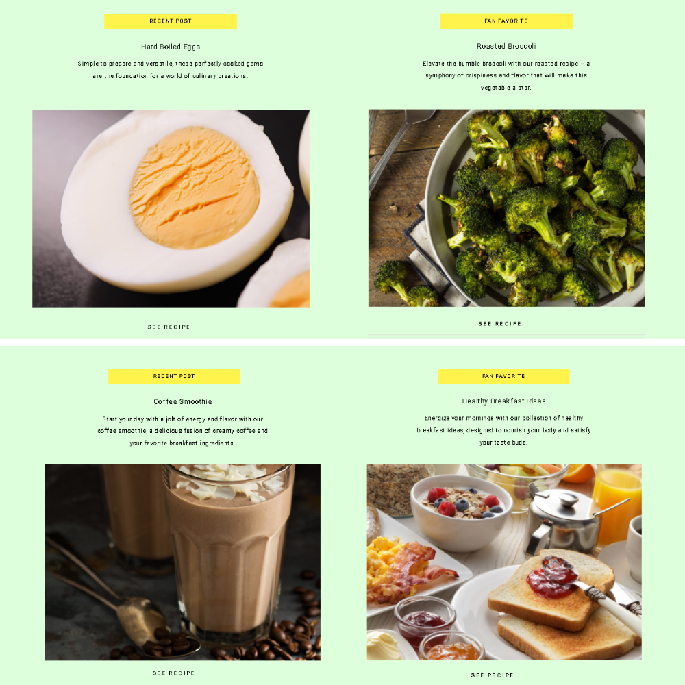
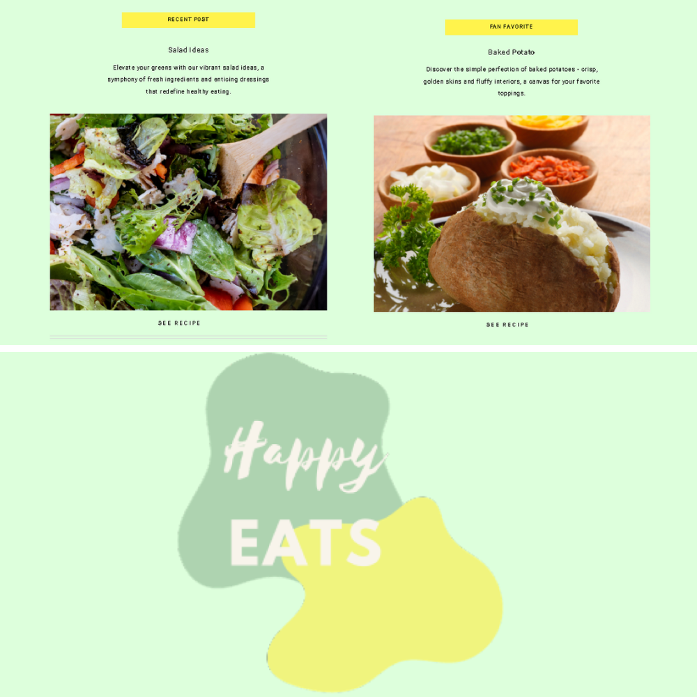
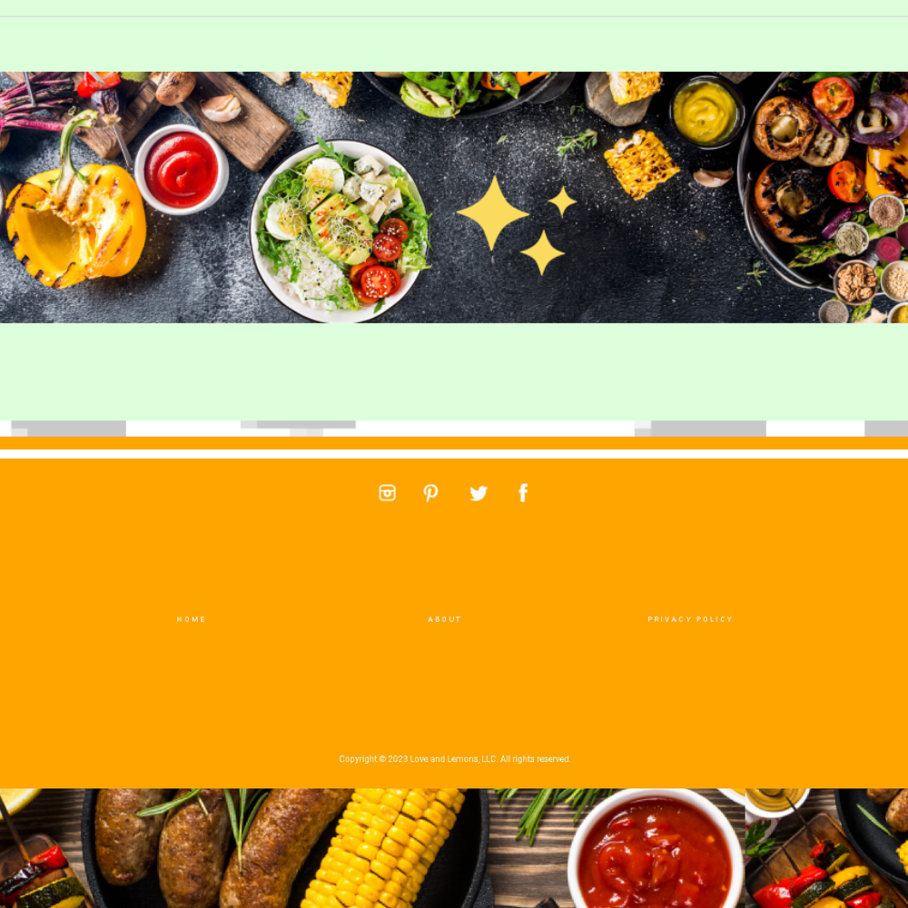

# FancyyEats 🍲

Welcome to my recipe website! Explore a variety of delicious recipes and find inspiration for your next culinary adventure.

## Table of Contents 📜

- [About Us](#about-us)
- [Recipes](#recipes)
  - [Spaghetti Squash Recipe](#spaghetti-squash-recipe)
  - [Pumpkin Bread Recipe](#pumpkin-bread-recipe)
  - [Best Soup Recipes](#best-soup-recipes)
  - [Margherita Pizza Recipe](#margherita-pizza-recipe)
  - [Pumpkin Soup Recipe](#pumpkin-soup-recipe)
  - [Banana Bread Recipe](#banana-bread-recipe)
  - [Pumpkin Pancakes Recipe](#pumpkin-pancakes-recipe)
  - [Butternut Squash Recipe](#butternut-squash-recipe)
  - [Hard Boiled Eggs Recipe](#hard-boiled-eggs-recipe)
  - [Roasted Broccoli Recipe](#roasted-broccoli-recipe)
  - [Coffee Smoothie Recipe](#coffee-smoothie-recipe)
  - [Healthy Breakfast Ideas Recipe](#healthy-breakfast-ideas-recipe)
  - [Salad Recipes](#salad-recipes)
  - [Baked Potato Recipe](#baked-potato-recipe)

## About Us 🌟

Discover the story behind our love for cooking and sharing delightful recipes.

## Landing Page 🍽️

## Contributing 🤝

If you have suggestions or find any issues, feel free to open an issue or create a pull request. Contributions are welcome!

## License 📄

This project is licensed under MIT License - see the [LICENSE](LICENSE) file for details.

## Show Your Support ⭐

If you find this project useful, consider giving it a star on GitHub. It's a small gesture that means a lot!

⭐ [Star this Repository](https://github.com/maltsh/Portfolio)
